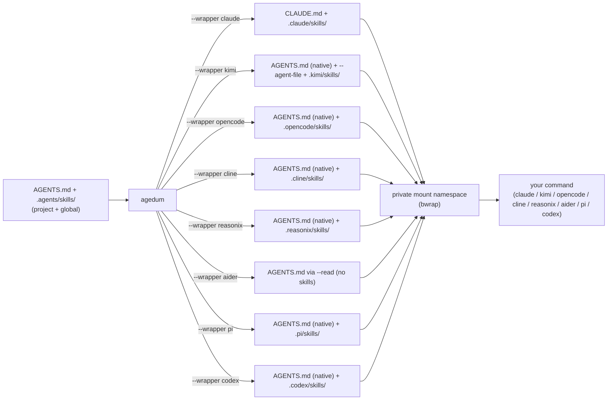

# agedum

<p class="tagline">Go on — one source, every agent.</p>

> Latin *agedum* — "go on! / get going!"

Agent CLIs each want their instructions and skills in their own place and format:
Claude reads `CLAUDE.md` and `.claude/skills/`, kimi reads a project `AGENTS.md` but
needs an `--agent-file` for user-scope instructions plus a `~/.kimi/skills/` tree, and
the next one will be different again. `agedum` lets you keep **one** agent-neutral
source and renders it for whichever harness you launch.

- **Instructions** live in a root [`AGENTS.md`](source-shape.md#agentsmd) — plain markdown.
- **Skills** live in [`.agents/skills/<name>/`](source-shape.md#skills) as `SKILL.md`,
  with optional task files, scripts, and a per-harness `SKILL.<harness>.md` overlay.

At launch agedum compiles that source to the harness's native layout in a throwaway
directory, then runs your command inside a **private mount namespace**
([bubblewrap](https://github.com/containers/bubblewrap)) where the compiled files
appear at their expected paths — visible only to that process and its children, never
written into your real tree or `$HOME`.

```bash
# The normal way to launch: name a provider; agedum sets its model/auth env and
# injects your source, then runs the harness named in that provider's config.
agedum claude-deepseek -p "review this change"
agedum kimi            -p "review this change"
agedum opencode-deepseek run "review this change"
```

A [provider config](provider.md) names the harness and its model/auth; `agedum <name>`
resolves it from a `.env`, injects the source, and launches. Under the hood it uses
**wrapper mode** (`agedum --wrapper <harness> -- <command>`), the lower-level entry that
just injects the source and runs a command — reach for that directly only when you want
the context with no provider env (e.g. native Claude with your own login).

## Why agedum

You maintain agent context — house style, review checklists, project conventions,
reusable skills — and you want it to follow you across agent CLIs without
copy-pasting into each one's bespoke layout. `agedum` is the translation layer:

- **Author once.** `AGENTS.md` + `.agents/skills/` is the [emerging cross-agent
  convention](https://agents.md). Keep your sources in it; let agedum do the per-harness
  rendering.
- **Two scopes, kept distinct.** A [global](source-shape.md#scopes) source (`~/.config/agents/`)
  travels with you; a [project](source-shape.md#scopes) source lives in the repo. agedum lands each
  at its own native location so the harness still sees them as user-scope vs
  project-scope — they are never silently merged.
- **No footprint.** The compiled `CLAUDE.md` / skills exist only inside the launched
  process's [mount namespace](internals.md). Your working tree and `$HOME` are
  untouched; agedum refuses to overlay a git-tracked path.

## How it fits together



1. [Locate the source](source-shape.md) — project root + global config.
2. [Compile per harness](wrapper.md) — render to the harness's native shape.
3. [Inject + run](internals.md) — bind the compiled files into a private namespace and
   exec your command.

## Status

| Harness | Flag | Status |
|---|---|---|
| Claude | `--wrapper claude` | Implemented — project + global scope |
| kimi   | `--wrapper kimi`   | Implemented — project + global scope |
| opencode | `--wrapper opencode` | Implemented — project + global scope |
| Cline  | `--wrapper cline`  | Implemented — project + global scope; provider mode |
| reasonix | `--wrapper reasonix` | Implemented — project + global scope; provider mode |
| aider  | `--wrapper aider`  | Implemented — instructions via `--read` (no skills); provider mode |
| pi     | `--wrapper pi`     | Implemented — project + global scope; provider mode (custom endpoint + subagent routing) |

[Provider mode](provider.md) (`agedum <provider-name>`) is the normal entry point; it
launches a harness from a provider config JSON, resolving its env from a `.env`. Wrapper
mode (`agedum --wrapper <harness> -- <command>`) is the lower-level path it builds on.

agedum is Linux-only and requires `bwrap`
([bubblewrap](https://github.com/containers/bubblewrap)) on `PATH` for the virtual-FS
launch.

## Learn more

- [Install](install.md) — install, prerequisites, dev mode
- [Source & scopes](source-shape.md) — the `AGENTS.md` + `.agents/skills/` layout, and the project vs global scopes
- [Wrapper mode](wrapper.md) — run a command in the injected context; how each harness resolves
- [Provider mode](provider.md) — launch a harness from a provider config JSON
- [Harnesses](harnesses/index.md) — one page per harness: wrapper resolution + provider config
- [CLI reference](cli.md) — flags and invocation contract
- [Internals](internals.md) — the mount-namespace launch and its safety rules
- [Source on GitHub](https://github.com/vcoeur/agedum) · [`agedum` on PyPI](https://pypi.org/project/agedum/)
