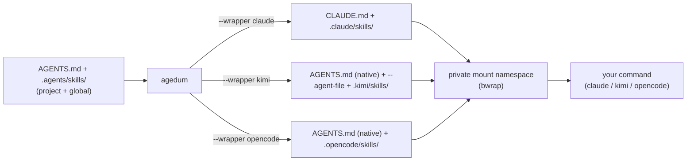

# agedum

<p class="tagline">Go on — one source, every agent.</p>

> Latin *agedum* — "go on! / get going!"

Agent CLIs each want their instructions and skills in their own place and format:
Claude reads `CLAUDE.md` and `.claude/skills/`, kimi reads a project `AGENTS.md` but
needs an `--agent-file` for user-scope instructions plus a `~/.kimi/skills/` tree, and
the next one will be different again. `agedum` lets you keep **one** agent-neutral
source and renders it for whichever harness you launch.

- **Instructions** live in a root [`AGENTS.md`](source-shape.md#agentsmd) — plain markdown.
- **Skills** live in [`.agents/skills/<name>/`](source-shape.md#skills) as `SKILL.md`,
  with optional task files, scripts, and a per-harness `SKILL.<harness>.md` overlay.

At launch agedum compiles that source to the harness's native layout in a throwaway
directory, then runs your command inside a **private mount namespace**
([bubblewrap](https://github.com/containers/bubblewrap)) where the compiled files
appear at their expected paths — visible only to that process and its children, never
written into your real tree or `$HOME`.

```bash
# Render the project + global source for Claude, then run Claude inside it:
agedum --wrapper claude -- claude -p "review this change"

# Same source, rendered for kimi or opencode instead:
agedum --wrapper kimi     -- kimi -p "review this change"
agedum --wrapper opencode -- opencode run "review this change"
```

`--wrapper <harness>` chooses the *format*; everything after `--` is the command, run
verbatim. The two are decoupled, so one source can front any agent CLI. To launch a
harness with a provider/model/auth environment as well, compile a provider config into
a shell wrapper with [build-script mode](build-script.md).

## Why agedum

You maintain agent context — house style, review checklists, project conventions,
reusable skills — and you want it to follow you across agent CLIs without
copy-pasting into each one's bespoke layout. `agedum` is the translation layer:

- **Author once.** `AGENTS.md` + `.agents/skills/` is the [emerging cross-agent
  convention](https://agents.md). Keep your sources in it; let agedum do the per-harness
  rendering.
- **Two scopes, kept distinct.** A [global](scopes.md) source (`~/.config/agents/`)
  travels with you; a [project](scopes.md) source lives in the repo. agedum lands each
  at its own native location so the harness still sees them as user-scope vs
  project-scope — they are never silently merged.
- **No footprint.** The compiled `CLAUDE.md` / skills exist only inside the launched
  process's [mount namespace](internals.md). Your working tree and `$HOME` are
  untouched; agedum refuses to overlay a git-tracked path.

## How it fits together



1. [Locate the source](source-shape.md) — project root + global config.
2. [Compile per harness](harnesses.md) — render to the harness's native shape.
3. [Inject + run](internals.md) — bind the compiled files into a private namespace and
   exec your command.

## Status

| Harness | Flag | Status |
|---|---|---|
| Claude | `--wrapper claude` | Implemented — project + global scope |
| kimi   | `--wrapper kimi`   | Implemented — project + global scope |
| opencode | `--wrapper opencode` | Implemented — project + global scope |

The bare `--claude` / `--kimi` / `--opencode` flags still work as deprecated aliases.
[Build-script mode](build-script.md) compiles a provider config into a launcher script.

Wrapper mode is Linux-only and requires `bwrap`
([bubblewrap](https://github.com/containers/bubblewrap)) on `PATH`; build-script mode
(pure codegen) runs anywhere.

## Learn more

- [Install](install.md) — install, prerequisites, dev mode
- [Source shape](source-shape.md) — the structure of `AGENTS.md` and `.agents/skills/`
- [Scopes](scopes.md) — project vs global (user) scope, and where each lands
- [Harnesses](harnesses.md) — exactly what agedum does for each `--wrapper <harness>`
- [CLI reference](cli.md) — flags and invocation contract
- [Build-script](build-script.md) — compile a provider config JSON into a launcher script
- [Internals](internals.md) — the mount-namespace launch and its safety rules
- [Source on GitHub](https://github.com/vcoeur/agedum) · [`agedum` on PyPI](https://pypi.org/project/agedum/)
