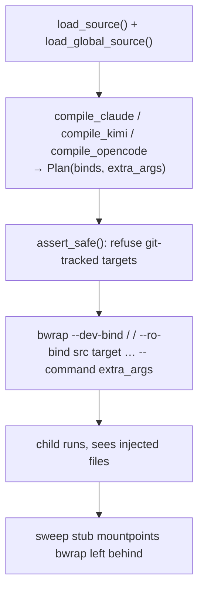

# Internals

agedum's launch is deliberately simple: compile the source to a throwaway directory,
then run the command under [bubblewrap](https://github.com/containers/bubblewrap) so
the compiled files appear at their expected paths for that process — and only that
process. The real working tree and `$HOME` are never written to.

## The launch pipeline



Internally this is three modules:

- **`sources.py`** — locates the project root and the project/global source files into
  a `Source` (`root`, `agents_md`, `skills_dir`).
- **`harness.py`** — `compile_claude` / `compile_kimi` / `compile_opencode` render a `Source` pair into a
  `Plan`: a list of absolute `(compiled-file → mount-target)` binds **plus**
  `extra_args` to append to the command.
- **`launcher.py`** — `assert_safe`, `build_bwrap_argv`, and `run_virtualfs` validate,
  compose the `bwrap` argv, run the command, and clean up.

The compiled tree lives under a `tempfile.mkdtemp()` directory that is removed when the
command exits.

## The mount namespace

The `bwrap` argv starts by mirroring the whole real filesystem read-write into the
namespace, then read-only-binds each compiled file over its target:

```text
bwrap --dev-bind / / --ro-bind <compiled> <target> … -- <command> <extra_args>
```

Because the binds use **absolute** targets, the same mechanism places project-scope
files inside the tree (`./CLAUDE.md`) and global-scope files under the user config dir
(`~/.claude/...`). A `--ro-bind` masks any pre-existing file or directory at the target
for the duration of the run, and the mask is visible only inside this namespace — other
processes, and your shell after the command exits, see the original tree.

This is why agedum is harness-agnostic at the launch layer: every agent CLI ultimately
just *reads files*, and the namespace makes the compiled files be those files.

## Safety

Two rules, both validated empirically and not to be regressed:

### No git-tracked targets

The namespace shares the project's **real, shared** `.git` directory — it is not
masked. So a `git add` / `git commit` run *inside* the namespace writes to the real
repository. If agedum overlaid a git-tracked file (say a real `CLAUDE.md` you keep in
the repo), injected content could be committed by accident.

`assert_safe` therefore **refuses to inject over any git-tracked path**. Targets must
be untracked and gitignored. Targets outside the project repo (e.g. `~/.claude/...`)
are never tracked by this repo, so they are allowed. In practice: list `CLAUDE.md`,
`.claude/`, and `.kimi/` in your `.gitignore`.

### Stub sweeping

To bind a file at a path that does not yet exist, `bwrap` creates the mountpoint on the
real filesystem first. After the namespace exits, those mountpoints remain as **empty
stubs** (a 0-byte file, or an empty directory) — the *injected content* never leaks,
but the empty placeholder can.

`run_virtualfs` records which candidate paths (each target **and its immediate parent**,
e.g. the `.claude` dir created to hold `.claude/skills`) existed before the run, and
after the command sweeps the ones it created — deepest first, and only if still empty.
Anything that pre-existed is left alone. The net effect: a clean working tree after the
command, with the real repo untouched.

## Adding a harness

A new harness is a single compiler function `compile_<harness>(project, global_, dest)
-> Plan`. It renders the source however that harness expects and returns binds and/or
`extra_args`. Register it in the CLI's compiler table under a `--<harness>` flag. The
launcher and safety rules are shared, so a new harness inherits the namespace,
git-safety, and cleanup for free.
