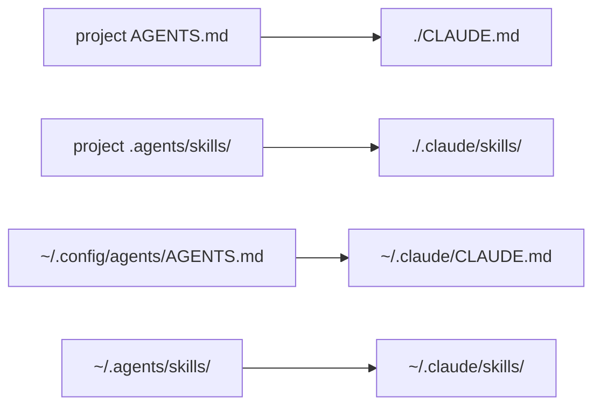

# Scopes

agedum reads the agent-neutral source at **two scopes** and keeps them distinct all the
way through. This mirrors how agent CLIs already think about context: there is a
*user-scope* layer that travels with you across every project, and a *project-scope*
layer that lives in a given repo. agedum preserves that distinction rather than
flattening it.

| Scope | Instructions source | Skills source |
|---|---|---|
| **Project** | `<root>/AGENTS.md` | `<root>/.agents/skills/` |
| **Global** (user) | `~/.config/agents/AGENTS.md` | `~/.agents/skills/` |

`<root>` is the discovered [project root](source-shape.md#locating-the-source): the
nearest ancestor of your current directory holding `AGENTS.md`, `.agents/`, or `.git`.

The global instructions path honours `$XDG_CONFIG_HOME` — if set, agedum reads
`$XDG_CONFIG_HOME/agents/AGENTS.md` instead of `~/.config/agents/AGENTS.md`. The global
skills path is always `~/.agents/skills/`.

The **global** `AGENTS.md` may also carry a per-harness overlay beside it: a sibling
`AGENTS.<harness>.md` (e.g. `AGENTS.claude.md`) is merged onto the base when compiling
for that harness. See [per-harness overlay](source-shape.md#agentsharnessmd-per-harness-overlay-user-scope).
This applies at user scope only — there is no project-scope `AGENTS.<harness>.md`.

## Where each scope lands

The key design choice: each scope is rendered to **its own native harness location**.
agedum never concatenates the two into one file — the harness reads both natively and
applies its own precedence, exactly as it would if you had authored them by hand.

For the **Claude** harness:

| Scope | Instructions target | Skills target |
|---|---|---|
| Project | `<root>/CLAUDE.md` | `<root>/.claude/skills/` |
| Global | `$CLAUDE_CONFIG_DIR/CLAUDE.md` (default `~/.claude/CLAUDE.md`) | `$CLAUDE_CONFIG_DIR/skills/` (default `~/.claude/skills/`) |

Claude reads its user-scope config (`~/.claude/`) and the project tree (`./`)
independently, so landing the two scopes separately preserves the scope semantics. The
project `CLAUDE.md` holds only the project instructions; the user `CLAUDE.md` holds
only the global ones.

The destinations differ for kimi: the project `AGENTS.md` is read natively at its
source location (no injection), the global `AGENTS.md` is injected via a generated
`--agent-file`, and skills bind to `~/.kimi/skills/` and `./.kimi/skills/`. opencode is
like Claude but with its own native project read: project `AGENTS.md` stays in place,
global `AGENTS.md` binds to `~/.config/opencode/AGENTS.md`, and skills bind to
`./.opencode/skills/` and `~/.config/opencode/skills/`. Cline is the same shape as
opencode: project `AGENTS.md` stays in place, global `AGENTS.md` binds to the cross-tool
`~/.agents/AGENTS.md`, and skills bind to `./.cline/skills/` and `~/.cline/skills/`. See
[Harnesses](harnesses.md) for the full per-harness mapping.

## Only the two scope paths are touched

For the global scope, agedum overlays **only** the harness's instruction file and
skills directory under the user config dir — for Claude, just `~/.claude/CLAUDE.md` and
`~/.claude/skills/`. Everything else in `~/.claude` is left exactly as it is: your
`~/.claude.json` auth, settings, history, and any other state are never shadowed. The
overlay is scoped as tightly as possible.

The skills overlay is tighter still: agedum binds each skill folder it ships
individually (`~/.claude/skills/<name>`), so a hand-authored skill you keep in that dir
but agedum does not ship stays visible. Only same-named folders are replaced. See
[the mount namespace](internals.md#the-mount-namespace).

`$CLAUDE_CONFIG_DIR` is honoured throughout, so if you relocate Claude's config dir,
the global scope follows it.

## Either scope may be empty

You do not need both scopes. Common setups:

- **Project only** — a repo with its own `AGENTS.md` + `.agents/skills/`, no global
  source. Useful for shipping agent context with the code.
- **Global only** — personal instructions and skills under `~/.config/agents/` +
  `~/.agents/skills/` that you want in every project, run from a directory with no
  project source.
- **Both** — the global layer travels with you; the project layer adds repo-specific
  context on top. The harness sees them as user-scope and project-scope respectively.

If a given scope has no `AGENTS.md`, only its skills are rendered (and vice-versa). If
*both* scopes are entirely empty, agedum prints a warning and runs your command with
nothing injected — it never refuses to launch on that basis.
