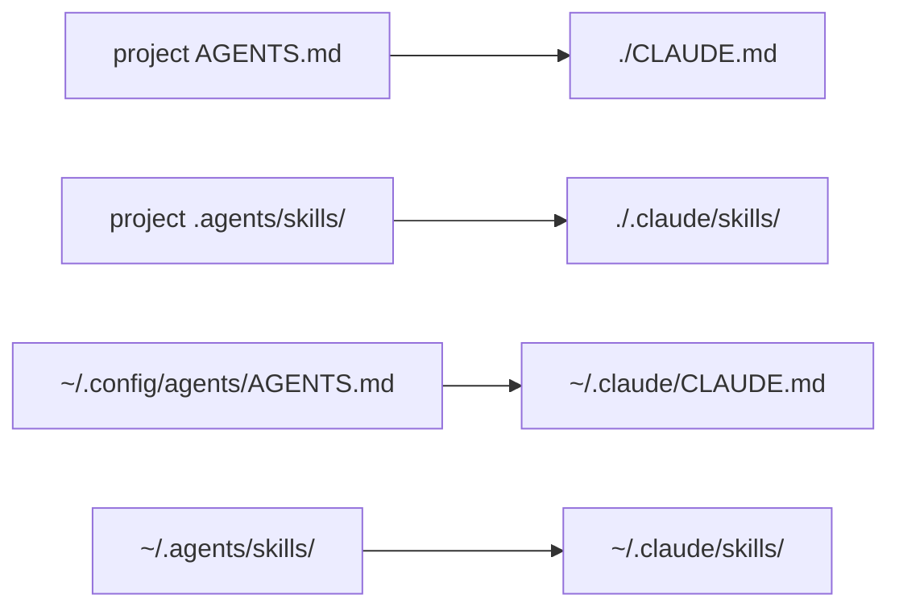

# Source & scopes

agedum reads a single **agent-neutral source** and renders it per harness at launch.
The source is the [`AGENTS.md`](https://agents.md) convention plus a sibling skills
tree:

```
my-project/
├── AGENTS.md                     # instructions (plain markdown)
└── .agents/
    └── skills/
        ├── review/
        │   ├── SKILL.md          # base skill: name + description + body
        │   ├── SKILL.claude.md   # optional Claude-only overlay
        │   ├── SKILL.kimi.md     # optional kimi-only overlay
        │   ├── SKILL.opencode.md # optional opencode-only overlay
        │   ├── SKILL.cline.md    # optional Cline-only overlay
        │   ├── checklist.md      # task file, copied verbatim
        │   └── lint.sh           # script, copied verbatim
        └── release/
            └── SKILL.md
```

Nothing here is harness-specific except the optional `SKILL.<harness>.md` overlays —
that is the whole point. You author once; agedum translates. agedum reads this source at
**two [scopes](#scopes)** — a project copy in the repo and a global copy under your home
config — and lands each at its own native harness location.

## AGENTS.md

A plain markdown file at the source root holding the standing instructions for the
agent — house style, conventions, what to do and not do. agedum carries it to each
harness's instruction location **without rewriting its content** — only relocating it (or
leaving it in place for a harness that reads `AGENTS.md` natively). For exactly where it
lands per harness, see the [harness pages](harnesses/index.md); for the project vs global
copies, see [Scopes](#scopes) below.

There is no front-matter contract on `AGENTS.md` — it is opaque markdown. Keep config
out of it; agedum carries instructions, not settings.

### `AGENTS.<harness>.md` — per-harness overlay (user scope)

The **user-scope** `AGENTS.md` may carry a harness-specific overlay beside it — the
instructions analogue of [`SKILL.<harness>.md`](#skillharnessmd-per-harness-overlay).
When agedum compiles the global source for harness `H`, it merges
`~/.config/agents/AGENTS.md` (base) with `~/.config/agents/AGENTS.<harness>.md` when that
sibling exists:

- `AGENTS.claude.md` is applied for the claude harness, `AGENTS.kimi.md` for kimi,
  `AGENTS.opencode.md` for opencode, `AGENTS.cline.md` for Cline. An overlay for a
  *different* harness is ignored.
- Unlike `SKILL.md`, `AGENTS.md` has no front-matter to union — the merge is a plain body
  concatenation: the base, a blank line, then the overlay body.
- This is **user scope only**. A project-scope `AGENTS.<harness>.md` is not merged — for
  kimi, opencode, and cline the project `AGENTS.md` is read natively and never injected, so
  a project overlay would have nowhere to land.

## Skills

A **skill** is a directory under `.agents/skills/<name>/`. The directory name is the
skill name. Each skill is rendered into the harness's skills location as a directory
of the same name.

### `SKILL.md` — the base

Every skill has a base `SKILL.md`: YAML front-matter (at minimum `name` and
`description`) followed by the skill body. This is the harness-neutral definition and
is used as-is when there is no overlay for the active harness.

```markdown
---
name: review
description: Review a change for correctness and house style before committing.
---

Walk the diff hunk by hunk. Flag anything that …
```

### `SKILL.<harness>.md` — per-harness overlay

When a skill needs something only one harness understands — e.g. Claude's
`allowed-tools` front-matter key, or harness-specific wording — put it in a
`SKILL.<harness>.md` file beside the base:

- `SKILL.claude.md` is applied when compiling for the claude harness.
- `SKILL.kimi.md` is applied when compiling for the kimi harness.
- `SKILL.opencode.md` is applied when compiling for the opencode harness.
- `SKILL.cline.md` is applied when compiling for the Cline harness.
- An overlay for a *different* harness is ignored (a `SKILL.kimi.md` is skipped when
  compiling for Claude, opencode, or Cline, and so on).

The overlay is **merged** onto the base, not substituted:

| Part | Merge rule |
|---|---|
| Front-matter | Union of both; **overlay keys win** on conflict |
| Body | Base body, then a blank line, then the overlay body (concatenated) |

So a base that declares `name` / `description` plus a `SKILL.claude.md` that adds
`allowed-tools: Read, Bash` and an extra paragraph yields one `SKILL.md` carrying all
three front-matter keys and both bodies. If a skill has no base body, the overlay body
stands alone.

### Task files, scripts, and other assets

Any other file or subdirectory inside a skill — checklists, prompt fragments, helper
scripts, data — is **copied verbatim** into the rendered skill directory. The only
files treated specially are `SKILL.md` (the base) and `SKILL.<harness>.md` (overlays);
every other `*.md` and every non-markdown file is carried through unchanged.

!!! note "What counts as an overlay"
    Only files matching `SKILL.<something>.md` are treated as overlays and filtered
    out of the copy. A `README.md` or `checklist.md` inside a skill is a normal asset
    and is copied. Name your overlays exactly `SKILL.<harness>.md`.

## Scopes { #scopes }

agedum reads the agent-neutral source at **two scopes** and keeps them distinct all the
way through. This mirrors how agent CLIs already think about context: a *user-scope* layer
that travels with you across every project, and a *project-scope* layer that lives in a
given repo. agedum preserves that distinction rather than flattening it.

| Scope | Instructions source | Skills source |
|---|---|---|
| **Project** | `<root>/AGENTS.md` | `<root>/.agents/skills/` |
| **Global** (user) | `~/.config/agents/AGENTS.md` | `~/.agents/skills/` |

### Locating the source { #locating-the-source }

agedum does not require you to point at the source — it discovers it:

- **Project root** is the nearest ancestor of the current directory (including it) that
  contains `AGENTS.md`, a `.agents/` directory, or `.git`. Within that root, `AGENTS.md`
  and `.agents/skills/` are picked up if present.
- **Global source** is `~/.config/agents/AGENTS.md` (honouring `$XDG_CONFIG_HOME` — if set,
  agedum reads `$XDG_CONFIG_HOME/agents/AGENTS.md`) for instructions, and `~/.agents/skills/`
  (always) for skills.

### Where each scope lands

The key design choice: each scope is rendered to **its own native harness location**.
agedum never concatenates the two into one file — the harness reads both natively and
applies its own precedence, exactly as it would if you had authored them by hand. For the
**Claude** harness:

| Scope | Instructions target | Skills target |
|---|---|---|
| Project | `<root>/CLAUDE.md` | `<root>/.claude/skills/` |
| Global | `$CLAUDE_CONFIG_DIR/CLAUDE.md` (default `~/.claude/CLAUDE.md`) | `$CLAUDE_CONFIG_DIR/skills/` (default `~/.claude/skills/`) |



The targets differ per harness — kimi reads the project `AGENTS.md` natively and injects
the global one via a `--agent-file`; opencode and cline read the project `AGENTS.md`
natively and bind the global one to their own config path. See the
[harness pages](harnesses/index.md) for each harness's full mapping.

### Only the two scope paths are touched

For the global scope, agedum overlays **only** the harness's instruction file and skills
directory under the user config dir — for Claude, just `~/.claude/CLAUDE.md` and
`~/.claude/skills/`. Everything else in `~/.claude` is left exactly as it is: your
`~/.claude.json` auth, settings, history, and any other state are never shadowed. The
overlay is scoped as tightly as possible.

The skills overlay is tighter still: agedum binds each skill folder it ships individually
(`~/.claude/skills/<name>`), so a hand-authored skill you keep in that dir but agedum does
not ship stays visible. Only same-named folders are replaced. See
[the mount namespace](internals.md#the-mount-namespace).

### Either scope may be empty

You do not need both scopes. Common setups:

- **Project only** — a repo with its own `AGENTS.md` + `.agents/skills/`, no global
  source. Useful for shipping agent context with the code.
- **Global only** — personal instructions and skills under `~/.config/agents/` +
  `~/.agents/skills/` that you want in every project, run from a directory with no project
  source.
- **Both** — the global layer travels with you; the project layer adds repo-specific
  context on top. The harness sees them as user-scope and project-scope respectively.

If a given scope has no `AGENTS.md`, only its skills are rendered (and vice-versa). If
*both* scopes are entirely empty, agedum prints a warning and runs your command with
nothing injected — it never refuses to launch on that basis.
